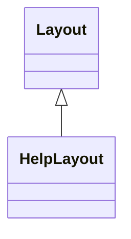
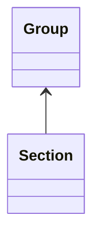
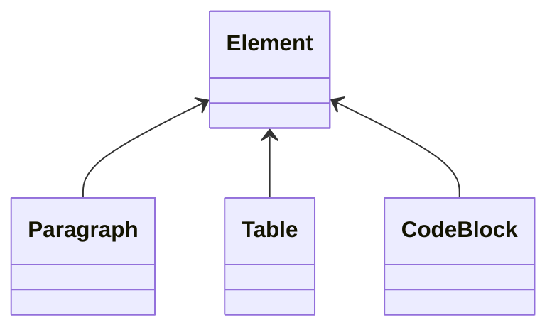
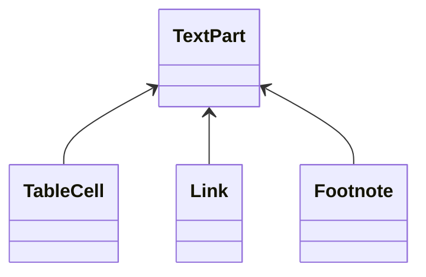
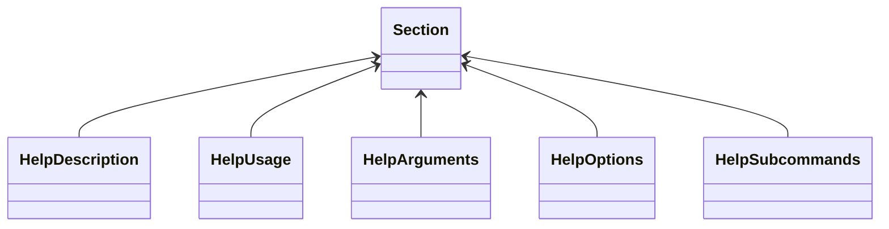
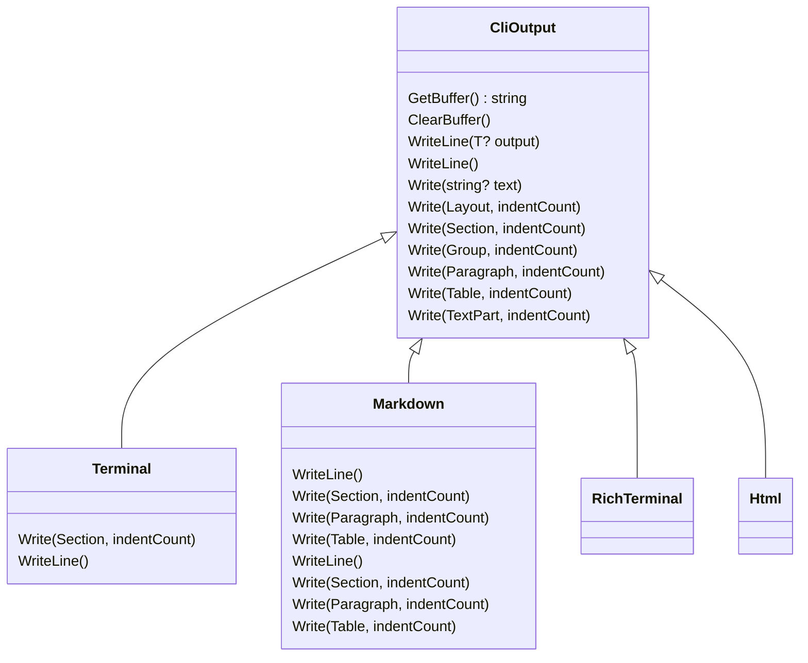

# Class diagrams

## Current

### Primitives

```mermaid
classDiagram
  Layout
  Layout <|-- HelpLayout

  class Layout {

  }

  class HelpLayout {

  }
```

```mermaid
classDiagram
  Group
  Group <-- Section
```

```mermaid
classDiagram
  Element
  Element <-- Paragraph
  Element <-- Table
  Element <-- CodeBlock
```

```mermaid
classDiagram
  TextPart
  TextPart <-- TableCell
  TextPart <-- Link
  TextPart <-- Footnote
```

### Help things

```mermaid
classDiagram
  Section <-- HelpDescription
  Section <-- HelpUsage
  Section <-- HelpArguments
  Section <-- HelpOptions
  Section <-- HelpSubcommands
```

### Targets

```mermaid
classDiagram

    CliOutput
    CliOutput <|-- Terminal
    CliOutput <|-- Markdown
    CliOutput <|-- RichTerminal
    CliOutput <|-- Html
  
    class CliOutput  {
      GetBuffer() string
      ClearBuffer()
      WriteLine<T>(T? output)
      WriteLine()
      Write(string? text)
      Write(Layout, indentCount)
      Write(Section, indentCount)
      Write(Group, indentCount)
      Write(Paragraph, indentCount)
      Write(Table, indentCount)
      Write(TextPart, indentCount)
    }
  
    class Terminal {
      Write(Section, indentCount)
      WriteLine()
    }
  
    class Markdown  {
      WriteLine()
      Write(Section, indentCount)
      Write(Paragraph, indentCount)
      Write(Table, indentCount)
    }
  
    class Markdown  {
      WriteLine()
      Write(Section, indentCount)
      Write(Paragraph, indentCount)
      Write(Table, indentCount)
    }
```

## Proposed
