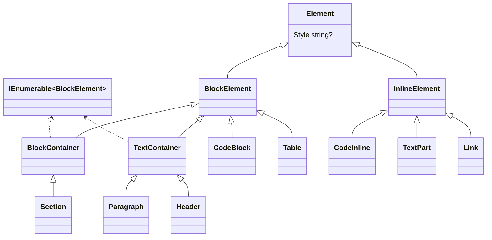

# Class diagram for primitives

```mermaid
classDiagram

    Element <|-- BlockElement
    Element <|-- InlineElement
    IEnumerable~BlockElement~ <.. BlockContainer
    IEnumerable~TextElement~ <.. TextContainer

    BlockElement<|-- BlockContainer
    BlockElement<|-- CodeBlock
    BlockElement<|-- TextContainer
    BlockElement<|-- Table

    BlockContainer <|-- Section
  

    TextContainer <|-- Paragraph
    TextContainer <|-- Header

    InlineElement <|-- CodeInline
    InlineElement <|-- TextPart
    InlineElement <|-- Link

    class Element {
      Style string?
    }

```