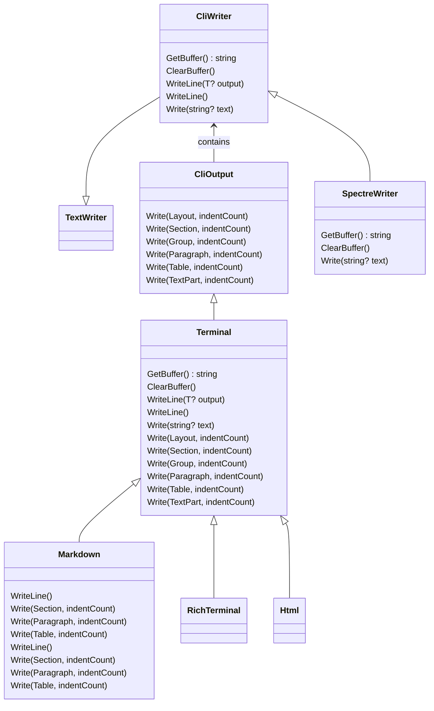

# Targets

```mermaid
classDiagram

    CliWriter --|> TextWriter

    CliOutput
    CliWriter <-- CliOutput : contains
    CliWriter <|--SpectreWriter
    CliOutput <|-- Terminal
    Terminal <|-- Markdown
    Terminal <|-- RichTerminal
    Terminal <|-- Html
  
    class CliWriter {
      GetBuffer() string
      ClearBuffer()
      WriteLine<T>(T? output)
      WriteLine()
      Write(string? text)
    }

    class SpectreWriter{
      GetBuffer() string
      ClearBuffer()
      Write(string? text)
    }

    class CliOutput  {
      Write(Layout, indentCount)
      Write(Section, indentCount)
      Write(Group, indentCount)
      Write(Paragraph, indentCount)
      Write(Table, indentCount)
      Write(TextPart, indentCount)
    }

    class Terminal  {
      GetBuffer() string
      ClearBuffer()
      WriteLine<T>(T? output)
      WriteLine()
      Write(string? text)
      Write(Layout, indentCount)
      Write(Section, indentCount)
      Write(Group, indentCount)
      Write(Paragraph, indentCount)
      Write(Table, indentCount)
      Write(TextPart, indentCount)
    }

  
    class Markdown  {
      WriteLine()
      Write(Section, indentCount)
      Write(Paragraph, indentCount)
      Write(Table, indentCount)
    }
  
    class Markdown  {
      WriteLine()
      Write(Section, indentCount)
      Write(Paragraph, indentCount)
      Write(Table, indentCount)
    }
```